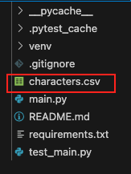

# Part 1 - Take-Home Project | Rick and Morty API Data Extractor

Hello, Inscribe Team!

Thank you for reviewing my project. Below are the instructions for running my project locally.

Note: You'll need `Python 3.6` or higher installed on your machine. 

## Getting Started

#### 1. Clone the Repository

```bash
git clone https://github.com/nate-j5/inscribe_take_home.git
```

#### 2. Create Virtual Environment

```bash
python3 -m venv venv
```

#### 3. Activate Virtual Environment

On macOS/Linux:
```bash
source venv/bin/activate
```

On Windows:
```bash
venv\Scripts\activate
```

#### 4. Install Dependencies

```bash
pip install -r requirements.txt
```

## Usage

Run the application:

```bash
python3 main.py
```

The script will:
1. Fetch all characters from the Rick and Morty API
2. Process the data to extract required fields
3. Generate a `characters.csv` file in the current directory


### Output

The application will display simplified progress in the terminal:

```
Fetching page 1...
Fetching page 2...
Fetching page 3...
...
Fetched 826 characters successfully
Created characters.csv with 826 character records
Process completed successfully
```

The file should be visible in the directory as well.



## Testing

The project includes unit tests that cover:

- **Data Processing**: Verifies that character data is correctly processed and transformed.
- **CSV Generation**: Ensures the CSV file is created with the correct format and content.

Run the test suite:

```bash
# Run tests with verbose output
pytest -v test_main.py
```

Expected output:

```
============================= test session starts ==============================
collected 2 items                                                                                  

test_main.py::TestRickAndMortyAPI::test_process_characters PASSED                            [ 50%]
test_main.py::TestRickAndMortyAPI::test_write_to_csv PASSED                                  [100%]

============================== 2 passed in 0.52s ===============================
```

## Implementation Details
- Fetch characters from the API (with pagination support)
- Output data to a clean, structured CSV 
- Implement error handling and logging
- Includes unit tests for data processing and CSV generation


## Future Enhancements
- Add support for multiple output formats (JSON, XML, Excel)
- Implement batch processing for large datasets
- Create a web interface for data browsing


--- 
Thank you for viewing my submission!


